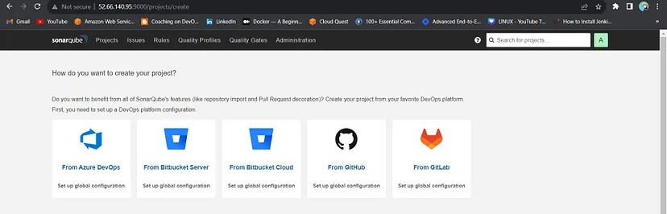
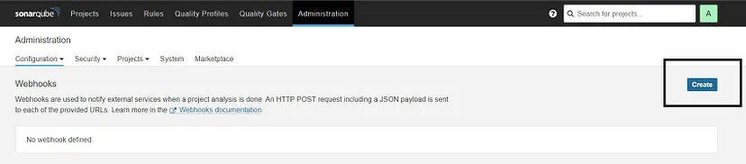

Steps:-

Step 1 — Launch an Ubuntu(22.04) T2 Large Instance

Step 2 — Install Jenkins, Docker and Trivy. Create a Sonarqube Container using Docker.

Step 3 — Install Plugins like JDK, Sonarqube Scanner, Nodejs, and OWASP Dependency Check.

Step 4 — Create a Pipeline Project in Jenkins using a Declarative Pipeline

Step 5 — Install OWASP Dependency Check Plugins

Step 6 — Docker Image Build and Push

Step 7 — Deploy the image using Docker

Step 8 — Terminate the AWS EC2 Instances.

Deploying Zomato Clone App with DevSecOps CI/CD

Hello friends, we will be deploying a React Js Zomato-clone. We will be using Jenkins as a CICD tool and deploying our application on a Docker container. I Hope this detailed blog is useful.

CLICK HERE FOR GITHUB REPOSITORY

Steps:-

Step 1 — Launch an Ubuntu(22.04) T2 Large Instance

Step 2 — Install Jenkins, Docker and Trivy. Create a Sonarqube Container using Docker.

Step 3 — Install Plugins like JDK, Sonarqube Scanner, Nodejs, and OWASP Dependency Check.

Step 4 — Create a Pipeline Project in Jenkins using a Declarative Pipeline

Step 5 — Install OWASP Dependency Check Plugins

Step 6 — Docker Image Build and Push

Step 7 — Deploy the image using Docker

Step 8 — Terminate the AWS EC2 Instances.

Now, let’s get started and dig deeper into each of these steps:-

STEP1:Launch an Ubuntu(22.04) T2 Large Instance
Launch an AWS T2 Large Instance. Use the image as Ubuntu. You can create a new key pair or use an existing one. Enable HTTP and HTTPS settings in the Security Group and open all ports (not best case to open all ports but just for learning purposes it’s okay).

Step 2 — Install Jenkins, Docker and Trivy
2A — To Install Jenkins
Connect to your console, and enter these commands to Install Jenkins

COPY

COPY

vi jenkins.sh
COPY

COPY

COPY

#!/bin/bash
sudo apt update -y
sudo apt install openjdk-11-jre -y
java -version
curl -fsSL https://pkg.jenkins.io/debian/jenkins.io-2023.key | sudo tee \
  /usr/share/keyrings/jenkins-keyring.asc > /dev/null
echo deb [signed-by=/usr/share/keyrings/jenkins-keyring.asc] \
  https://pkg.jenkins.io/debian binary/ | sudo tee \
  /etc/apt/sources.list.d/jenkins.list > /dev/null
sudo apt-get update -y
sudo apt-get install jenkins -y

COPY

COPY

sudo chmod 777 jenkins.sh
./jenkins.sh    # this will installl jenkins
Once Jenkins is installed, you will need to go to your AWS EC2 Security Group and open Inbound Port 8080, since Jenkins works on Port 8080.

Now, grab your Public IP Address

COPY

COPY

<EC2 Public IP Address:8080>
sudo cat /var/lib/jenkins/secrets/initialAdminPassword

Unlock Jenkins using an administrative password and install the suggested plugins.

Jenkins will now get installed and install all the libraries.

Create a user click on save and continue.

Jenkins Getting Started Screen.

2B — Install Docker
COPY

COPY

sudo apt-get update
sudo apt-get install docker.io -y
sudo usermod -aG docker $USER   #my case is ubuntu
newgrp docker
sudo chmod 777 /var/run/docker.sock
After the docker installation, we create a sonarqube container (Remember to add 9000 ports in the security group).

COPY

COPY

docker run -d --name sonar -p 9000:9000 sonarqube:lts-community

Now our sonarqube is up and running

Enter username and password, click on login and change password

COPY

COPY

username admin
password admin

Update New password, This is Sonar Dashboard.

2C — Install Trivy
COPY

COPY

vi trivy.sh
COPY

COPY

sudo apt-get install wget apt-transport-https gnupg lsb-release -y
wget -qO - https://aquasecurity.github.io/trivy-repo/deb/public.key | gpg --dearmor | sudo tee /usr/share/keyrings/trivy.gpg > /dev/null
echo "deb [signed-by=/usr/share/keyrings/trivy.gpg] https://aquasecurity.github.io/trivy-repo/deb $(lsb_release -sc) main" | sudo tee -a /etc/apt/sources.list.d/trivy.list
sudo apt-get update
sudo apt-get install trivy -y
Next, we will log in to Jenkins and start to configure our Pipeline in Jenkins

Step 3 — Install Plugins like JDK, Sonarqube Scanner, NodeJs, OWASP Dependency Check
3A — Install Plugin
Goto Manage Jenkins →Plugins → Available Plugins →

Install below plugins

1 → Eclipse Temurin Installer (Install without restart)

2 → SonarQube Scanner (Install without restart)

3 → NodeJs Plugin (Install Without restart)

3B — Configure Java and Nodejs in Global Tool Configuration
Goto Manage Jenkins → Tools → Install JDK(17) and NodeJs(16)→ Click on Apply and Save

3C — Create a Job
create a job as Zomato Name, select pipeline and click on ok.

Step 4 — Configure Sonar Server in Manage Jenkins
Grab the Public IP Address of your EC2 Instance, Sonarqube works on Port 9000, so <Public IP>:9000. Goto your Sonarqube Server. Click on Administration → Security → Users → Click on Tokens and Update Token → Give it a name → and click on Generate Token

click on update Token

Create a token with a name and generate

copy Token

Goto Jenkins Dashboard → Manage Jenkins → Credentials → Add Secret Text. It should look like this

You will this page once you click on create

Now, go to Dashboard → Manage Jenkins → System and Add like the below image.

Click on Apply and Save

The Configure System option is used in Jenkins to configure different server

Global Tool Configuration is used to configure different tools that we install using Plugins

We will install a sonar scanner in the tools.

In the Sonarqube Dashboard add a quality gate also

Administration → Configuration →Webhooks

Click on Create

Add details

COPY

COPY

#in url section of quality gate
<http://jenkins-public-ip:8080>/sonarqube-webhook/

Let’s go to our Pipeline and add the script in our Pipeline Script.

COPY

COPY

pipeline{
    agent any
    tools{
        jdk 'jdk17'
        nodejs 'node16'
    }
    environment {
        SCANNER_HOME=tool 'sonar-scanner'
    }
    stages {
        stage('clean workspace'){
            steps{
                cleanWs()
            }
        }
        stage('Checkout from Git'){
            steps{
                git branch: 'main', url: 'https://github.com/Aj7Ay/Zomato-Clone.git'
            }
        }
        stage("Sonarqube Analysis "){
            steps{
                withSonarQubeEnv('sonar-server') {
                    sh ''' $SCANNER_HOME/bin/sonar-scanner -Dsonar.projectName=zomato \
                    -Dsonar.projectKey=zomato '''
                }
            }
        }
        stage("quality gate"){
           steps {
                script {
                    waitForQualityGate abortPipeline: false, credentialsId: 'Sonar-token' 
                }
            } 
        }
        stage('Install Dependencies') {
            steps {
                sh "npm install"
            }
        }
    }
}
Click on Build now, you will see the stage view like this

To see the report, you can go to Sonarqube Server and go to Projects.

You can see the report has been generated and the status shows as passed. You can see that there are 1.3k lines. To see a detailed report, you can go to issues.

Step 5 — Install OWASP Dependency Check Plugins
GotoDashboard → Manage Jenkins → Plugins → OWASP Dependency-Check. Click on it and install it without restart.

First, we configured the Plugin and next, we had to configure the Tool

Goto Dashboard → Manage Jenkins → Tools →

Click on Apply and Save here.

Now go configure → Pipeline and add this stage to your pipeline and build.

COPY

COPY

stage('OWASP FS SCAN') {
            steps {
                dependencyCheck additionalArguments: '--scan ./ --disableYarnAudit --disableNodeAudit', odcInstallation: 'DP-Check'
                dependencyCheckPublisher pattern: '**/dependency-check-report.xml'
            }
        }
        stage('TRIVY FS SCAN') {
            steps {
                sh "trivy fs . > trivyfs.txt"
            }
        }
The stage view would look like this,

You will see that in status, a graph will also be generated and Vulnerabilities.

Step 6 — Docker Image Build and Push
We need to install the Docker tool in our system, Goto Dashboard → Manage Plugins → Available plugins → Search for Docker and install these plugins

Docker

Docker Commons

Docker Pipeline

Docker API

docker-build-step

and click on install without restart

Now, goto Dashboard → Manage Jenkins → Tools →

Add DockerHub Username and Password under Global Credentials

Add this stage to Pipeline Script

COPY

COPY

stage("Docker Build & Push"){
            steps{
                script{
                   withDockerRegistry(credentialsId: 'docker', toolName: 'docker'){   
                       sh "docker build -t zomato ."
                       sh "docker tag zomato chandraaws/zomato:latest "
                       sh "docker push chandraaws/zomato:latest "
                    }
                }
            }
        }
        stage("TRIVY"){
            steps{
                sh "trivy image chandraaws/zomato:latest > trivy.txt" 
            }
        }
You will see the output below, with a dependency trend.

When you log in to Dockerhub, you will see a new image is created

Now Run the container to see if the app coming up or not by adding the below stage

COPY

COPY

stage('Deploy to container'){
     steps{
            sh 'docker run -d --name zomato -p 3000:3000 chandraaws/zomato:latest'
          }
      }
stage view

<Jenkins-public-ip:3000>

You will get this output

Step 8: Terminate instances.
Complete Pipeline
COPY

COPY

pipeline{
    agent any
    tools{
        jdk 'jdk17'
        nodejs 'node16'
    }
    environment {
        SCANNER_HOME=tool 'sonar-scanner'
    }
    stages {
        stage('clean workspace'){
            steps{
                cleanWs()
            }
        }
        stage('Checkout from Git'){
            steps{
                git branch: 'main', url: 'https://github.com/Aj7Ay/Zomato-Clone.git'
            }
        }
        stage("Sonarqube Analysis "){
            steps{
                withSonarQubeEnv('sonar-server') {
                    sh ''' $SCANNER_HOME/bin/sonar-scanner -Dsonar.projectName=zomato \
                    -Dsonar.projectKey=zomato '''
                }
            }
        }
        stage("quality gate"){
           steps {
                script {
                    waitForQualityGate abortPipeline: false, credentialsId: 'Sonar-token' 
                }
            } 
        }
        stage('Install Dependencies') {
            steps {
                sh "npm install"
            }
        }
        stage('OWASP FS SCAN') {
            steps {
                dependencyCheck additionalArguments: '--scan ./ --disableYarnAudit --disableNodeAudit', odcInstallation: 'DP-Check'
                dependencyCheckPublisher pattern: '**/dependency-check-report.xml'
            }
        }
        stage('TRIVY FS SCAN') {
            steps {
                sh "trivy fs . > trivyfs.txt"
            }
        }
        stage("Docker Build & Push"){
            steps{
                script{
                   withDockerRegistry(credentialsId: 'docker', toolName: 'docker'){   
                       sh "docker build -t zomato ."
                       sh "docker tag zomato chandraaws/zomato:latest "
                       sh "docker push chandraaws/zomato:latest "
                    }
                }
            }
        }
        stage("TRIVY"){
            steps{
                sh "trivy image chandraaws/zomato:latest > trivy.txt" 
            }
        }
        stage('Deploy to container'){
            steps{
                sh 'docker run -d --name zomato -p 3000:3000 chandraaws/zomato:latest'
            }
        }
    }
}

increasing root ebs volume in ubuntu server

Increasing Root Volume Size of an EBS Backed EC2 Instance
by Emre Yilmaz Sep 24, 2017 AWS • Amazon EBS • Amazon EC2 Istanbul
When you launch an Amazon EC2 instance, you define an Amazon EBS volume size. However, you may eventually need more disk space later for some reason. In this blog post, I will demonstrate an example of how you can increase the root volume size of an EC2 Linux instance.

There are three components of this operation:

AWS Elastic Block Storage (EBS) volumes attached as block devices to our EC2 instance, such as /dev/xvda.
Partitions on block devices, such as /dev/xvda1.
Mounted filesystem on the operating system such as "/dev/xvda1" mounted on "/".
Checking the Block Devices and the Filesystem on Your EC2 Instance
First of all, let’s connect to our EC2 instance using SSH. For demonstration, I will be using a t2.micro type of Amazon EC2 instance backed by an 8 GB EBS volume initially and running Ubuntu 16.04LTS operating system.

After connecting to our EC2 instance, let’s list its block devices available:

~$ sudo lsblk
NAME    MAJ:MIN RM SIZE RO TYPE MOUNTPOINT
xvda    202:0    0   8G  0 disk
└─xvda1 202:1    0   8G  0 part /
Here, we see that there are 8GB on the xvda block device, and all 8GB is allocated to the xvda1 partition as expected.

Then, let’s display the amount of disk space used and available on the Linux filesystem.

~$ sudo df -h
Filesystem      Size  Used Avail Use% Mounted on
udev            488M     0  488M   0% /dev
tmpfs           100M  3.1M   97M   4% /run
/dev/xvda1      7.7G  965M  6.8G  13% /
tmpfs           496M     0  496M   0% /dev/shm
tmpfs           5.0M     0  5.0M   0% /run/lock
tmpfs           496M     0  496M   0% /sys/fs/cgroup
tmpfs           100M     0  100M   0% /run/user/1000
As can be seen, we have a 7.7 GB disk space available on /dev/xvda1, which we will increase by 2 GB. AWS automatically allocated the remaining, nearly 0.3 GB, to the udev and tmpfs.

One more thing to go, we need to determine whether the disk use ext3-ext4 or xfs file system:

~$ sudo file -sL /dev/xvda1
/dev/xvda1: Linux rev 1.0 ext4 filesystem data, UUID=3e13556e-d28d-407b-bcc6-97160eafebe1, volume name "cloudimg-rootfs" (needs journal recovery) (extents) (large files) (huge files)
So, we checked the initial state of our EC2 instance. Next, let’s continue by resizing its volume using AWS Management Console.

Modifying Your EBS volume on AWS Management Console
On our Amazon EC2 dashboard, let’s click Volumes under the ELASTIC BLOCK STORE section on the left. Here, we need to select the volume attached to our instance and click Modify from the Actions menu. You can see the screenshot below.

Modifying an EBS volume from the Actions menu
Let’s increase the volume size on the window opened. As an example, I will resize my EBS volume to 10GB.

Modifying an EBS volume to 10 Gb from the Actions menu
After clicking Modify, AWS will display an approval window to avoid unintended actions; click Yes on this window to continue. After that, a success message will be displayed for the start of the EBS volume resize operation, which you can ignore by clicking Close.

After getting the volume increase request, AWS will resize the EBS volume in seconds. You will need to refresh the page a few times to see that the process finished successfully.

Successful result of modifying an EBS volume to 10 Gb from the Actions menu
We resized our EBS volume successfully. However, we need to extend the OS file system on our EC2 instance for the new EBS volume size to take effect.

Extending the OS Filesystem (ext3, ext4) on Your EC2 Instance
Please remember that we initially listed the block devices on our EC2 instance and saw that all 8GB of xvda was allocated to the xvda1 partition. Now, let’s list them once more after resizing our EBS volume to see what it displays:

~$ sudo lsblk
NAME    MAJ:MIN RM SIZE RO TYPE MOUNTPOINT
xvda    202:0    0  10G  0 disk
└─xvda1 202:1    0   8G  0 part /
As you see, the size of the xvda block increased from 8 GB to 10 GB; but the xvda1 partition uses only 8 GB of it. We should allocate all 10 GB to xvda1, right? We can do this using the growpart command as our filesystem is ext4.

~$ sudo growpart /dev/xvda 1
CHANGED: partition=1 start=2048 old: size=16775135 end=16777183 new: size=20969439,end=20971487
Now, let’s confirm that all the storage is allocated to the xvda1 partition by listing the block devices again:

~$ sudo lsblk
NAME    MAJ:MIN RM SIZE RO TYPE MOUNTPOINT
xvda    202:0    0  10G  0 disk
└─xvda1 202:1    0  10G  0 part /
OK. We increased block storage, but we also need to resize the filesystem to be able to use it:

~$ sudo resize2fs /dev/xvda1
resize2fs 1.42.13 (17-May-2015)
Filesystem at /dev/xvda1 is mounted on /; on-line resizing required
old_desc_blocks = 1, new_desc_blocks = 1
The filesystem on /dev/xvda1 is now 2621179 (4k) blocks long.
Let’s confirm the operation by redisplaying the filesystem disk space usage.

~$ sudo df -h
Filesystem      Size  Used Avail Use% Mounted on
udev            488M     0  488M   0% /dev
tmpfs           100M  3.1M   97M   4% /run
/dev/xvda1      9.7G  964M  8.7G  10% /
tmpfs           496M     0  496M   0% /dev/shm
tmpfs           5.0M     0  5.0M   0% /run/lock
tmpfs           496M     0  496M   0% /sys/fs/cgroup
tmpfs           100M     0  100M   0% /run/user/1000
As you see, the size of the /dev/xvda1 partition became 9.7 GB with a net 2 GB increase. Hence, our EBS volume resize operation is successful.

Conclusion
In the lifetime of our EBS backed EC2 instances, we may need to increase the root or other EBS volumes of them. In this blog post, I demonstrated to achieve this on an Ubuntu EC2 instance with the ext4 filesystem. For ext3, the process is also the same. If your instance runs Amazon Linux or Centos operating systems with ext3 or ext4 filesystems, you can apply the same method here.

However, if your filesystem is xfs, you need to do the filesystem extension using the xfsprog command. You can find the link for its details on the AWS documentation in the references section below.

Thanks for reading!